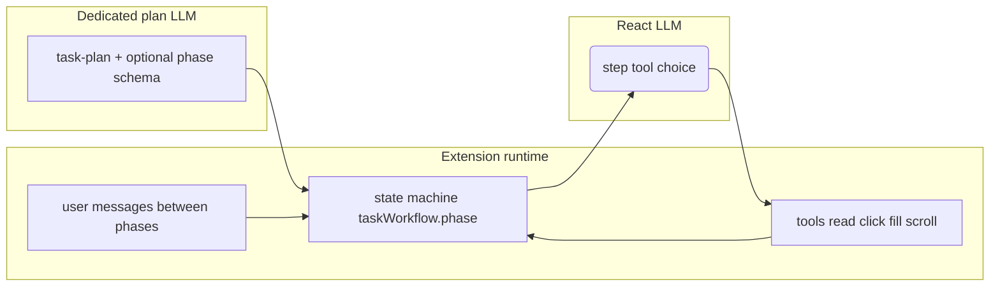

# Transactional shopping E2E (e.g. Amazon) — requirement vs codebase & implementation plan

This document maps **your target flow** to **what exists today** and a **phase-by-phase build plan**.

---

## 1. Success criteria (your requirements)

| Step | Requirement |
|------|--------------|
| 1 | User on retailer home → goal like *“Book shoes under $20”*. |
| 2 | **Dedicated plan from LLM** (multi-phase, persisted across turns). |
| 3 | **Search via search bar** (or equivalent) → listings; **no routine approval**. |
| 4 | **Navigate** to SERP / listing surface. |
| 5 | **Surface top ~5 candidates** aligned to goal; **pause for human choice**. |
| 6 | User may ask **“show 5 more”** (prioritize items with Add to cart present). |
| 7 | User may apply **natural-language filters** (e.g. *“black shoes only”*) → agent applies facets / re-reads → new shortlist. |
| 8 | User **selects product** → open PDP → **cart** (header) → proceed toward checkout → **confirm only where money/commitment**. |
| 9 | **No unnecessary approvals.** |
|10 | Fix **token / context limits** when moving between home vs `/s?k=` (different DOM). |
|11 | Same **logical session** across URL changes (**not** resetting chat/state as “different page”). |

---

## 2. Current system (baseline)

### 2.1 What already works (`demo.html` path)

- **Form-centric workflow**: structured inventory, intent plan, fill, submit flows work well when the DOM is coherent.
- **ReAct loop** ([`apps/extension/src/background/agent/agent-runner.js`](apps/extension/src/background/agent/agent-runner.js)): `callLLM` → tool (`read_page`, `click_element`, `fill_input`, …) → `read_page` refresh.
- **Task workflow shell**: transactional heuristic → [`maybeStartTransactionalWorkflow`](apps/extension/src/background/agent/agent-runner.js) → **`/api/llm/task-plan`** → store `taskWorkflow` on agent state ([`apps/extension/src/background/core/state.js`](apps/extension/src/background/core/state.js)).
- **Optional fast SERP jump**: [`maybeFastRetailSearchNavigation`](apps/extension/src/background/agent/agent-runner.js) when plan has **`searchTerms` + valid same-origin `searchLandingUrlTemplate`** ([`TASK_PLAN_SYSTEM_PROMPT`](apps/backend/src/prompts/index.ts)).
- **Listing hints**: [`read_page`](apps/extension/src/content/tools/read_page.js) attaches **`listingCandidates`** (cards → compact list, `hasAddToCartCta`, `agentId`, etc.).
- **Approvals**: default **`REQUIRE_CLICK_APPROVAL: false`** ([`config.js`](apps/extension/src/background/core/config.js)); optional routine heuristics in [`tool-executor.js`](apps/extension/src/background/tools/tool-executor.js).
- **Per-site persistence**: `_agentSessions[origin]` holds `chatHistory`, `taskWorkflow`, `pageContext` keyed by **page origin** (scheme + host + port) so a new tab on the same retailer (e.g. checkout) shares the session; [`CopilotSw.setActiveTabSession(tabId)`](apps/extension/src/background/core/state.js) resolves the tab’s URL to that key. Tab id is still used for automation and UI message scoping.
- **Page refresh after navigation**: content [`navigation.js`](apps/extension/src/content/observers/navigation.js) fires `pageContextChanged` → SW calls `readPage` and [`patchTabSessionPageContext`](apps/extension/src/background/core/state.js).

### 2.2 Gaps (why Amazon E2E is not covered end-to-end)

1. **No explicit workflow phase machine**  
   `taskWorkflow` stores `plan` but **no `phase`/`awaitingUserChoice`/`shortlist`** fields. Everything after search is generic ReAct; there is **no mandated “stop and show top 5, wait.”**

2. **Multi-turn continuity is fragile**  
   [`inferTransactionalE2EIntent`](apps/extension/src/background/task-workflow.js) + [`keepWorkflow`](apps/extension/src/background/agent/agent-runner.js): follow-ups clear `taskWorkflow` unless they look like short “pick/choose/#/filter/…” snippets. Filters like **“black shoes only”** or **longer confirmations** risk **clearing** the workflow and losing the dedicated plan mid-journey.

3. **Composer blocks during a run**  
   [`Popup.vue`](apps/extension/src/ui/Popup.vue) uses `canSend`: **no sends while agent isRunning**. `startAgent` is awaited until **`runAgentLoop` finishes**. So **in-run human choice between inner steps is impossible** unless the agent **returns after each conversational gate** (`final_answer` + `continueLoop=false`).

4. **“Top 5” is not deterministic**  
   `listingCandidates` is DOM-heuristic capped (e.g. 15), not relevance-ranked vs goal; no dedicated **present 5 numbered options** UX contract.

5. **“Five more”**  
   Requires **pagination / scroll / load more / next page** tool strategy; not centrally specified in prompts or planner.

6. **Context / tokens**  
   [`buildConversationMessages`](apps/backend/src/services/llmService.ts): only **`chatHistory.slice(-10)`**; page via [`summarizePageContext`](apps/backend/src/utils/pageContext.ts) + compact mode in [`llm.js`](apps/extension/src/background/llm/llm.js) when task workflow active. Huge Amazon DOM can still overwhelm **summary/token limits** or omit critical controls.

7. **Amazon vs homepage vs SERP “two pages” feeling**  
   State is keyed by **tab**, not URL, so continuity is achievable; breakage more often comes from **cleared workflow**, **lost plan context in prompts**, or **summary missing** listing blocks after SPA updates.

---

## 3. Target architecture (recommended)

### 3.1 Layered orchestration

- **Planner (LLM)**: Outputs **phases**, **searchTerms**, **constraints** (budget, colour), **`searchLandingUrlTemplate`**, and optional **`selectionPolicy`** (“top-rated with prime”, etc.).
- **Runtime**: Owns **`taskWorkflow.phase`** and **when** to call ReAct vs **stop for user**.
- **ReAct**: Executes **within** a phase (e.g. apply filters).

### 3.2 Workflow phases (suggested enums)

Stored on `CopilotSw.agentState.taskWorkflow` (extend object in [`agent-runner.js`](apps/extension/src/background/agent/agent-runner.js) / persisted session):

| Phase | Behavior |
|--------|-----------|
| `plan_ready` | Plan shown to user (already have summary). |
| `search_execute` | Fast URL or fill+submit; refresh context. |
| `serp_browse` | Build **shortlist slice** from `listingCandidates` + ranking hint; **`final_answer` with numbered options**; **exit agent run** (`isRunning` false). |
| `awaiting_pick` | User message → resolve selection / “more five” → maybe change to `loading_more`. |
| `filter_apply` | NL filter → facet clicks per ReAct bounded steps → back to shortlist presentation. |
| `pdp` | Navigate to PDP; confirm correct product. |
| `cart` | Header cart icon click; basket page. |
| `checkout_nav` | Proceed; **approval only at payment / submit order**. |
| `done` | Clear or archive workflow. |

### 3.3 Human-in-the-loop gates

Split each user-visible choice into **separate agent invocations**:

1. Run ends with **`final_answer`** listing `#1 … #5` and “Reply with number or refinement.”  
2. User sends reply → **`keepWorkflow`** must stay true for **any** message while workflow active (**not** only `shortFollowUp` regex). Implement: **`if taskWorkflow.awaitingInput then never clear`** or **clear only on explicit “cancel”**.

### 3.4 Approvals policy

| Action | Approval |
|--------|-----------|
| Search, filters, listing clicks, PDP, cart icon, proceed to checkout screens | Off by default (`REQUIRE_CLICK_APPROVAL: false`). |
| Place order, pay now, subscription, sensitive forms | Gate (modal or structured confirm). |

---

## 4. Implementation plan (ordered)

### Phase A — Planner & state machine (foundation)

1. **Extend task-plan schema** ([`TASK_PLAN_SYSTEM_PROMPT`](apps/backend/src/prompts/index.ts)):  
   phases as above; **constraints** array already exists — use for price cap / colour explicitly.  
2. **`taskWorkflow` shape**: `{ active, phase, plan, browseOffset, lastShortlistRefs[], awaitingInput, constraintsSnapshot }`.  
3. **Relax / replace `clearTaskWorkflow` on follow-up**: While `taskWorkflow.active && !explicitCancel`, **never** drop workflow on secondary messages.

### Phase B — Search & listings

4. **Ensure search path**: Reliable `searchLandingUrlTemplate` from plan using **page URL origin**, or scripted **fill + submit** when template omitted.  
5. **Shortlist builder** (extension util): From `listingCandidates`, sort by **price vs budget**, **rating if present**, **hasAddToCartCta** for “show more with add to cart”; output **max 5** with stable `agentId` for click.  
6. **Present & stop**: After shortlist, push assistant message with **numbered list**; **break** ReAct (`final_answer`-style semantics) → return to Popup.

### Phase C — Pagination & filters

7. Prompt + tools: scroll / “See more results” / pagination patterns for Amazon SERP (selector discovery via compact listing region).  
8. **NL filter interpreter**: Lightweight LLM or rule pass → facet instructions; bounded ReAct to click facet chips **then read_page**, rebuild shortlist.

### Phase D — Cart & checkout

9. PDP add-to-cart vs navigate via listing; explicit phase transitions.  
10. Cart/header navigation; pause before **terminal payment** clicks.

### Phase E — Token & context

11. Raise or tune [`MAX_PAGE_CONTEXT_CHARS`](apps/extension/src/background/core/config.js) / summary for SERP-only slices.  
12. Ensure **summaries include** `listingCandidates` preview when on `/s`; consider **phase-specific** payloads (omit irrelevant sections).  
13. Optional **rolling summary**: compress older turns into one assistant block instead of trusting `slice(-10)` alone.

### Phase F — Verification

14. Scripted Playwright scenarios: home → search → five options → reply → filter → PDP → cart (fixture or live flag).  
15. Regression: original **demo/form** scenarios unchanged.

---

## 5. Summary

Your **demo** path is solid for **structured forms**. The **Amazon journey** requires a **explicit multi-phase orchestration layer** persisted across turns, **early returns for user choices**, loosening **`keepWorkflow`** rules, richer **listing shortlist UX**, **pagination/filter** playbooks, **stricter summarization**, and **approval only at money edges**. Implementation should start with **workflow state + follow-up semantics**, then search + shortlist presentation, then filters/pagination and checkout.
